# Arquitetura 3 camadas

A arquitetura tradicional em **3 Camadas** — [**DAL**](../../dicionario-banrisul.md#dal---data-access-layer), [**BLL**](../../dicionario-banrisul.md#bll---business-logic-layer) e [**UI**](../../dicionario-banrisul.md#ui---user-interface) — é um dos pilares sobre os quais o --- se baseia (também é válido para o --- e o ---), fazendo uso de sua própria convenção personalizada de nomenclaturas, com as camadas [**Q**](../../dicionario-banrisul.md#camada-q), [**S**](../../dicionario-banrisul.md#camada-s) e [**W**](../../dicionario-banrisul.md#camada-w) (direcionada para ---/---).

> Nota: Neste conteúdo abordaremos principalmente as camadas DAL e BLL, pois os seus equivalentes (Q e S) são as camadas contidas no ---. A camada UI (e a equivalente W) serão abordadas em maior detalhe no **Curso Framework --- ---**.

Mas afinal, o que é isso que chamamos de **camada**?

## Camadas

Camadas ajudam a **organizar responsabilidades, separar fluxos, reduzir acoplamento e definir como a informação se move** dentro de qualquer sistema. A ideia de camadas não é exclusiva de aplicações de software e aparece em várias áreas:

- Redes de computadores: Camadas como física, enlace, transporte e aplicação permitem transmitir informações de forma organizada, sem que cada nível precise conhecer os detalhes dos outros;
- Arquitetura de solução: Sistemas complexos frequentemente são organizados em camadas especializadas, como por exemplo camada de gateway e roteamento (que gerencia tráfego e segurança), camada de aplicação (que processa regras e lógica de negócio), camada de cache (para reduzir latência e acesso repetitivo a dados) e camada de persistência/bases de dados. Essa organização permite que cada camada evolua, seja mantida ou escalada de forma independente, melhorando desempenho, confiabilidade e flexibilidade de um sistema complexo;
- Interno a uma aplicação: dentro de uma única aplicação, camadas como DAL (acesso a dados), BLL (regras de negócio) e UI (interface com o usuário) isolam responsabilidades, permitindo que cada módulo seja desenvolvido e testado independentemente.

Em todos os casos, a **redução de acoplamento** entre camadas é uma premissa fundamental da engenharia de software. Ela garante que mudanças em uma camada tenham impacto mínimo sobre as demais, facilitando manutenção, escalabilidade e evolução de um sistema.

No âmbito de uma aplicação, que é o nosso objetivo aqui, uma organização de arquitetura em 3 camadas faria com que organizássemos nosso código da seguinte forma:

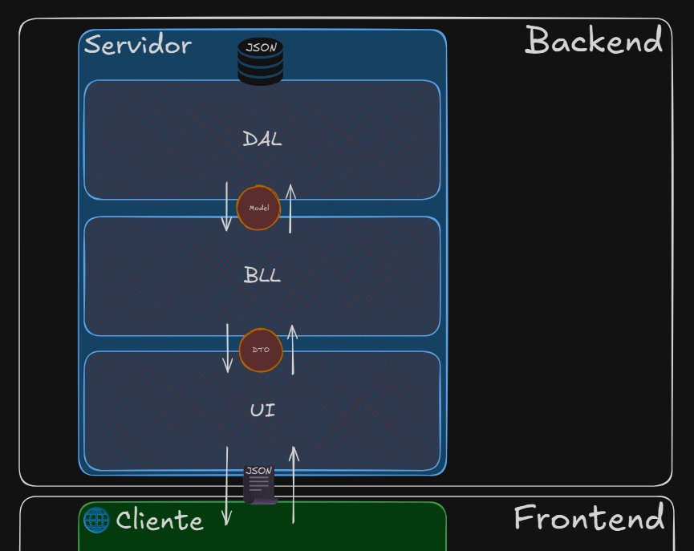

No nosso caso da **solução Cliente-Servidor**, decidimos que a UI ainda estará no backend, ou seja, a interface com o usuário, no nosso entendimento, é a saída da nossa **Rota**. Neste caso o frontend não participaria da arquitetura 3 camadas e teria sua própria organização independente.

Já no --- é diferente, pois a camada respectiva à UI transpassa o backend e vai para frontend.

A moral da história é que, diferentes empresas podem implementar diferentes variações da arquitetura 3 camadas, inclusive tomando decisões diferentes de uso de padrões internos a cada camada: por exemplo, estamos enviando uma model de um determinado tipo para dentro da camada DAL, onde lá haverá um [**DAO**](../../dicionario-banrisul.md#dao---data-access-object) especializado em persistir aquele tipo para o seu respectivo JSON — em uma outra variação dessa solução, a model poderia ser eliminada da equação, e o DAO em si conter os dados do tipo, sendo um objeto que **representa por si só os dados da base (o que antes era responsabilidade da model) e ao mesmo tempo sabe como se persistir em JSON**.

## DAL - Data Access Layer

A camada [**DAL**](../../dicionario-banrisul.md#dal---data-access-layer) é responsável por tudo que envolve **manipulação de dados junto à base**. Ela se conecta, executa instruções e traduz resultados para estruturas manipuláveis pela aplicação.

Suas responsabilidades incluem:

- Gerenciar conexões e transações de dados;
- Encapsular detalhes internos da persistência e reutilização;
- Mapear resultados de buscas na base em objetos (estruturas manipuláveis pela aplicação);
- Executar consultas, listagens, inclusões, alterações e remoções dos dados da base.

Conceitualmente, a DAL **responde "como" os dados são obtidos ou persistidos**. Ela não conhece o motivo, a regra, o fluxo, o contexto de negócio. Ela só "enxerga" dados, tabelas, colunas e comandos.

Pode internamente usar de vários padrões, como DAOs (que vamos abordar), _Repositories_, _Active Records_, _Table Data Gateways_, etc.

> Nota: Pesquise você mesmo a respeito destes 3 últimos — não serão abordados nem explicados em aula.

## BLL — Business Logic Layer

A camada [**BLL**](../../dicionario-banrisul.md#bll---business-logic-layer) concentra **as regras de negócio** da aplicação — aquilo que dá significado aos dados. É nela principalmente que vamos aplicar a arte de transformar requisitos do negócio em problemas resolvidos através de software.

A ela pertencem as responsabilidades de:

- Validações e aplicação de regras de consistência;
- Cálculos e conversões de dados;
- Execução da gama de processos de negócio;
- Fluxos operacionais e tomadas de decisão condicionais.

A BLL **responde "o que" deve acontecer com os dados, e sob quais regras**. Por conceito, não deveria conhecer nenhum detalhe de como os dados são persistidos, para tal, ela deveria utilizar a DAL para esse tipo de atividade. Sua principal tarefa é validar dados e coordenar processos.

## Tráfego de DTOs e models

Agora que realmente temos as "camadas", tão mencionadas no conteúdo de DTOs, models e wrappers, podemos deixar mais claro esse "tráfego", principalmente dos DTOs e das models, em meio às camadas.

A forma mais comum de uso de DTOs e models em meio ao tráfego entre-camadas é:

### Quando em sentido UI ⟹ DAL - ida

Por exemplo, durante a **fase de envio** de uma requisição `POST` de criação de um novo item na base:

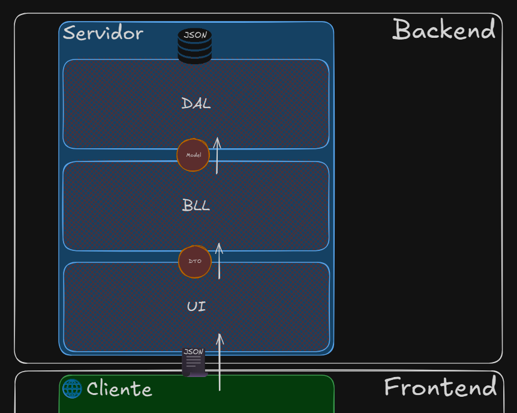

1. Independente de o que a UI seja no contexto (seja uma camada a mais no servidor ou o frontend inteiro), ela sempre vai transportar um DTO para a BLL. O DTO aqui ainda representa **a intenção da operação**, sem vistas à estrutura real da base de dados;
2. A BLL valida, aplica regras necessárias, e executa os fluxos onde vai transformar o DTO em model, e transportar para a DAL. A model aqui já vai representar a **estrutura espelhada das tabelas e campos** da base;
3. A DAL vai utilizar a model recebida para aí sim, com o seu conhecimento da infraestrutura de persistência, executá-la;
4. A partir daí a requisição volta no sentido contrário (fluxo omitido por brevidade).

### Quando em sentido DAL ⟹ UI - volta

Por exemplo, durante a **fase de resposta** de uma requisição `GET` de consulta de um item em específico armazenado na base:

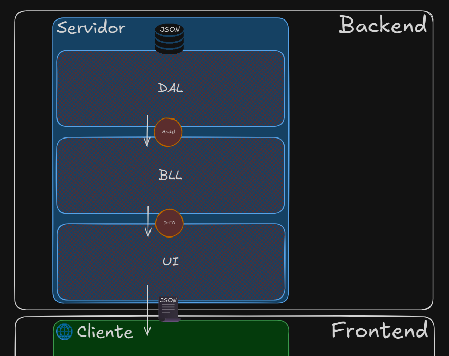

1. A requisição já passou por todas as camadas e chegou na DAL em formato de um pedido de um item em específico através de seu ID (fluxo omitido por brevidade).
2. A DAL, tendo em mãos o ID, vai usar seu conhecimento da infraestrutura de persistência para executar um **SELECT** (ou qualquer coisa semelhante) na base de dados, vai receber uma informação advinda da base, vai criar uma model a partir dessa informação recebida e vai retorná-la para a BLL.
3. A BLL ao receber essa model, vai transformá-la em um DTO respectivo, com base nas regras e e fluxos necessários para a operação, e retornar o DTO para a UI.
4. A UI receberá o DTOs e fará o seu trabalho de transformá-lo em resultado útil para o usuário.

> Nota: Já explicitado nos exemplos mas sempre vale reforçar: Aqui estamos tratando um fluxo de requisição HTTP/HTTPS, que sempre conta com ida e volta. O que fizemos no exemplo foi omitir a parte não relevante.

### Benefícios

O esquema de tráfego com essa separação evita acoplamento e permite que:

- A UI não conheça detalhes internos da aplicação e fique somente responsável em "conversar" com o usuário;
- A BLL seja o [**SSOT**](../../dicionario-banrisul.md#ssot---single-source-of-truth) em se tratando dos aspectos de conhecimento dos fluxos e regras de negócio;
- A DAL não conheça nenhum detalhe de aplicação que não seja a sua responsabilidade de atuar em infraestrutura de persistência de dados.

## Violações da arquitetura 3 camadas

- ❌ Tratar regras ou fluxos de negócios dentro da UI;
- ❌ Tratar infraestrutura de persistência dentro da UI;
- ❌ Tratar aspectos de interação com o usuário dentro da BLL;
- ❌ Tratar infraestrutura de persistência dentro da BLL;
- ❌ Tratar aspectos de interação com o usuário dentro da DAL;
- ❌ Tratar regras ou fluxos de negócios dentro da DAL.

## Laboratório

Vamos trabalhar agora na **v5 da nossa solução Cliente-Servidor** (fornecida na pasta da aula) para rearquitetar o servidor da nossa solução para comportar a arquitetura 3 camadas, criando novos projetos com cada responsabilidade, configurando as devidas dependências, e corrigindo possíveis violações que estejam sendo cometidas.
<!-- Boilerplate em [./_assets/04-cliente-servidor-boilerplate-v5/] -->

O nosso objetivo de estrutura de pastas, separando a aplicação em partes, é este:

```makefile
ClienteServidor\                      # Pasta da solução
|
├── Cliente\                          # Pasta do projeto Cliente (estrutura interna omitida por brevidade)
|
├── Servidor\                         # Pasta interna de solução para organizar grupo dos projetos do servidor
|   |
|   ├── C1_DAL\                       # Pasta do projeto - Camada DAL do servidor
|   |   ├── DAOs\                     # Pasta de DAOs (arquivos internos omitidos por brevidade)
|   |   ├── Models\                   # Pasta de models (arquivos internos omitidos por brevidade)
|   |   └── C1_DAL.csproj             # Arquivo .NET do projeto
|   |
|   ├── C2_BLL\                       # Pasta do projeto - Camada BLL do servidor
|   |   ├── DTOs\                     # Pasta de DTOs (arquivos internos omitidos por brevidade)
|   |   ├── Utils\                    # Pasta de utilitários de negócio — local por exemplo do FECONID (arquivos internos omitidos por brevidade)
|   |   └── C2_BLL.csproj             # Arquivo .NET do projeto
|   |
|   └── C3_UI\                        # Pasta do projeto - Camada UI do servidor
|       ├── Rotas\                    # Pasta de rotas (arquivos internos omitidos por brevidade)
|       ├── Program.cs                # Arquivo de startup (main)
|       └── C3_UI.csproj              # Arquivo .NET do projeto
|
└── ClienteServidor.sln               # Arquivo .NET da solução
```

Para tal, vamos fazer algumas operações sensíveis de reestruturação de arquivos. Precisamos seguir com cuidado o passo a passo, para não quebrar a aplicação em um estado descontrolado.

> Nota: Vamos usar uma convenção de prefixos `C1_`, `C2_` e `C3_` para representar os números das camadas. Isso é puramente didático.

### Passo 1: Remover o projeto Servidor

**Parte 1:** No _Visual Studio_, vamos remover o projeto **Servidor** clicando com o botão direito em cima do projeto Servidor, e selecionando a opção **Remove (Remover)**. A estrutura da solution no _Visual Studio_ deve ficar assim:

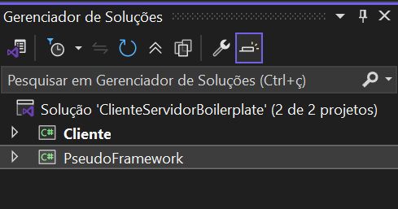

> Nota: Essa é apenas uma **remoção lógica**, que vai fazer com que o arquivo `.sln` (arquivo da solution) deixe de ter uma referência ao projeto Servidor.

**Parte 2:** No _Windows Explorer_, na pasta no nível da solution, vamos renomear a pasta `Servidor` para `_Servidor`. Isso vai abrir caminho para podermos criar uma nova **pasta de solução** chamada `Servidor`. A pasta da solution no _Windows Explorer_ deve ficar assim:

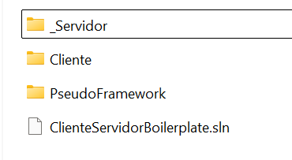

### Passo 2: Criar pasta de solução `Servidor`

No _Visual Studio_, vamos clicar com o botão direito em cima da solution, e vamos selecionar a opção **Add (Adicionar) ⟹ New Solution Folder (Nova Pasta de Solução)** e vamos nomeá-la `Servidor`. A estrutura da solution no _Visual Studio_ deve ficar assim:

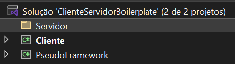

### Passo 3: Criar projetos do tipo _Class Library_ DAL e BLL

O processo de criação dos projetos seguirá esses dois passos feitos **uma vez para cada camada** — queremos duas camadas (dois projetos):

**Parte 1:** No _Visual Studio_, clicar com o botão direito em cima da nossa pasta recém criada `Servidor` e selecionar a opção **Add (Adicionar) ⟹ New Project (Novo Projeto)**.

**Parte 2:** Na janela de diálogo de criação de projeto, vamos pesquisar por "Class Library", e selecionar a opção **Class Library (.NET Framework)**. Garantindo que:

- O _name (nome)_ do projeto seja **"C1_DAL"** para o primeiro projeto e **"C2_BLL"** para o segundo;
- A _location (endereço/pasta)_ seja `C:\[...]\[pasta-solution]\Servidor\`;
  > Exemplo: `C:\Desenvhome\LABS\ClienteServidorBoilerplate\Servidor\`.
- O _framework_ selecionado esteja marcado como **.NET Framework 4.6.1** — a versão que atualmente estamos usando no boilerplate em geral.

Após criados os dois projetos, a estrutura da solution no _Visual Studio_ deve ficar assim:

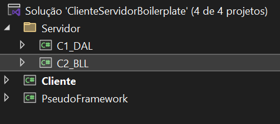

### Passo 4: Criar projeto do tipo _Console App_ UI

Muito semelhante ao passo anterior, mas agora um só projeto, que será de outro tipo:

**Parte 1:** No _Visual Studio_, clicar com o botão direito em cima da nossa pasta recém criada `Servidor` e selecionar a opção **Add (Adicionar) ⟹ New Project (Novo Projeto)**.

**Parte 2:** Na janela de diálogo de criação de projeto, vamos pesquisar por "Console App", e selecionar a opção **Console App (.NET Framework)**.

> Nota: Se houver outro tipo de projeto com o nome somente **Console App** ignore, ele é igual ao que selecionamos.

Também vamos garantir que:

- O _name (nome)_ do projeto seja **"C3_UI"**;
- A _location (endereço/pasta)_ seja `C:\[...]\[pasta-solution]\Servidor\`;
  > Exemplo: `C:\Desenvhome\LABS\ClienteServidorBoilerplate\Servidor\`.
- O _framework_ selecionado esteja marcado como **.NET Framework 4.6.1** — a versão que atualmente estamos usando no boilerplate em geral.

Após criado este terceiro projeto, a estrutura da solution no _Visual Studio_ deve ficar assim:

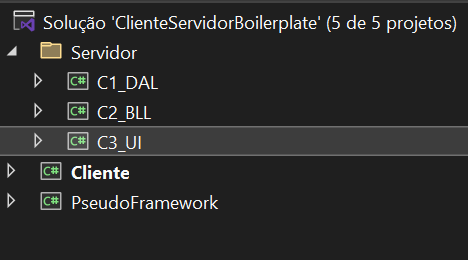

E no _Windows Explorer_, na pasta da solution, dentro da subpasta `Servidor`:

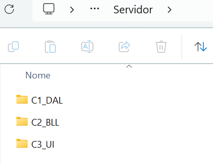

### Passo 5: Remover classes iniciais

Nos 3 projetos recém criados, há classes já criadas: `Class1.cs` no DAL e BLL, e `Program.cs` no UI. Podemos deletar completamente esses arquivos.

### Passo 6: Movimentação física dos arquivos

Vamos fazer movimentações entre-projetos dos arquivos puramente pelo _Windows Explorer_ em um primeiro momento, e após, fazer os devidos ajustes dentro do Visual Studio.

#### Movimentação física dos arquivos de responsabilidade da DAL

Relembrando: a DAL é responsável por tratar infraestrutura de persistência. Então precisamos mover as pastas `DAO` e `Models` da pasta de origem `C:\[...]\[pasta-solution]\_Servidor\` para a pasta de destino `C:\[...]\[pasta-solution]\Servidor\C1_DAL\`.

Após a movimentação, a pasta `C:\[...]\[pasta-solution]\Servidor\C1_DAL` no _Windows Explorer_ deve ficar assim:

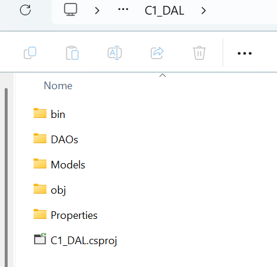

> Nota: Por que movemos as models para dentro de DAL e não para dentro de BLL? Esse ajuste é estratégico por causa da forma como vamos montar as **dependências**. Veremos o porquê nos próximos passos.

#### Movimentação física dos arquivos de responsabilidade da BLL

Relembrando: a BLL é responsável por tratar regras ou fluxos de negócios. Então precisamos mover as pastas `DTOs` e `Utils` (que contém a FECONID) da pasta de origem `C:\[...]\[pasta-solution]\_Servidor\` para a pasta de destino `C:\[...]\[pasta-solution]\Servidor\C2_BLL\`.

Após a movimentação, a pasta `C:\[...]\[pasta-solution]\Servidor\C2_BLL` no _Windows Explorer_ deve ficar assim:

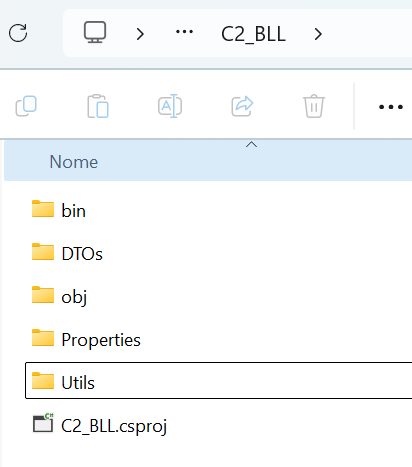

> Nota: Por que movemos os DTOs para dentro de BLL e não para dentro de UI? Esse ajuste é estratégico por causa da forma como vamos montar as **dependências**. Veremos o porquê nos próximos passos.

#### Movimentação física dos arquivos de responsabilidade da UI

Relembrando: a UI é responsável por tratar aspectos de interação com o usuário. Então precisamos mover a pasta `Rotas` e o próprio arquivo `Program.cs` (que nesse caso é a "porta de entrada" da nossa interação) da pasta de origem `C:\[...]\[pasta-solution]\_Servidor\` para a pasta de destino `C:\[...]\[pasta-solution]\Servidor\C3_UI\`.

Após a movimentação, a pasta `C:\[...]\[pasta-solution]\Servidor\C3_UI` no _Windows Explorer_ deve ficar assim:

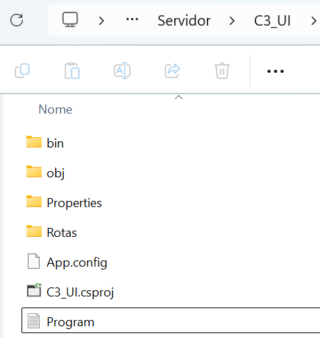

#### Deletar fisicamente a pasta `_Servidor`

Agora a pasta `_Servidor` não nos é mais útil. Podemos deletá-la completamente.

### Passo 7: Adição lógica dos arquivos nos projetos

Todos os arquivos foram movidos, mas pra efeitos de _Visual Studio_ (solution e projetos) nada mudou. Agora vamos incluí-los de fato aos projetos.

A primeira coisa que vamos precisar fazer, para cada projeto, é habilitar a visualização geral dos arquivos. Isso pode ser atingido selecionando o projeto, e na barra superior da janela _Solution Explorer_ clicar no ícone **Show All Files (Mostrar Todos os Arquivos)**:

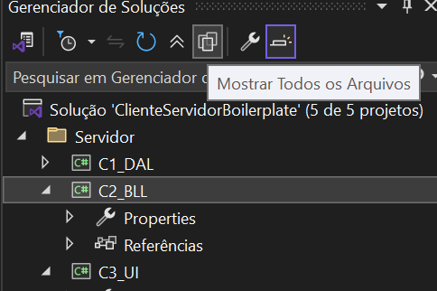

#### Adição lógica dos arquivos de responsabilidade da DAL

Já com as pastas `DAOs` e `Models` visíveis na hierarquia do projeto **C1_DAL** no _Visual Studio_, vamos clicar com o botão direito em cada uma das pastas e selecionar **Include In Project (Incluir no Projeto)**. Com isso os arquivos agora passarão a fazer realmente parte do projeto.

Porém, os _namespaces_ e _usings_ dos arquivos estarão apontando para uma estrutura incorreta de projeto. Vamos corrigir alterando:

- Em cada uma das models, de:
  
  ```csharp
  namespace Servidor.Models
  ```
  
  para:

  ```csharp
  namespace C1_DAL.Models
  ```

- Em cada um dos DAOs, de:

  ```csharp
  using Servidor.Models;
  // [...]
  
  namespace Servidor.DAOs
  ```

  para:

  ```csharp
  using C1_DAL.Models;
  // [...]

  namespace C1_DAL.DAOs
  ```

##### Adição da dependência do framework

Uma coisa muito interessante está acontecendo agora: mesmo com a nossa correção dos _namespaces_ e _usings_, temos ainda muitas quebras acontecendo por falta de classes que antes funcionavam através de referências ao projeto **PseudoFramework**. Com esses erros, conseguimos ver claramente o impacto que o framework está fazendo no nosso projeto — Ou seja — todas as **classes utilitárias e facilitadoras** que ele provê (nesse caso para a camada de persistência).

Vamos corrigir isso adicionando o que chamamos de **dependência**, que nada mais é do que um apontamento de referência a um outro projeto (ou pacote Nuget) com a intenção de poder usar as classes que este outro projeto disponibiliza. Vamos clicar com o botão direito em cima do projeto C1_DAL, clicar em **Add (Adicionar) ⟹ Reference (Referência)**, e na aba **Projects (Projetos)** da janela de diálogo, selecionar o projeto **PseudoFramework**:


Feito isso, tudo passará a voltar a funcionar e o projeto já estará em um estado compilável, pois todas as classes já tinham os devidos _usings_.

#### Adição lógica dos arquivos de responsabilidade da BLL

Precisamos fazer o mesmo processo que fizemos em DAL, agora em BLL.

- Incluir `DTOs` e `Utils` através do **Include In Project (Incluir no Projeto)**;
- Corrigir os namespaces dos DTOs, de:
  
  ```csharp
  namespace Servidor.DTOs
  ```
  
  para:
  
  ```csharp
  namespace C2_BLL.DTOs
  ```

- Corrigir o namespace da `Feconid.cs`, de:

  ```csharp
  namespace Servidor.Utils
  ```
  
  para:
  
  ```csharp
  namespace C2_BLL.Utils
  ```

> Nota: A BLL ainda não tem _usings_ para corrigir, e nem faz uso do **PseudoFramework**.

Feito isso, tudo estará funcionando e a BLL também já estará em estado compilável.

#### Adição lógica dos arquivos de responsabilidade da UI

E o mesmo processo das anteriores, agora em UI.

- Incluir `Rotas` e a `Program.cs` através do **Include In Project (Incluir no Projeto)**;
- Corrigir os namespaces das rotas, de:
  
  ```csharp
  namespace Servidor.Rotas
  ```
  
  para:
  
  ```csharp
  namespace C3_UI.Rotas
  ```

- Corrigir o namespace e os usings da `Program.cs`, de:

  ```csharp
  using Servidor.Rotas;
  // [...]
  
  namespace Servidor
  ```

  para:

  ```csharp
  using C3_UI.Rotas;
  // [...]

  namespace C3_UI
  ```

- Adicionar a dependência ao **PseudoFramework**.

Porém, esse projeto vai continuar não compilável, pois **temos violações importantes de arquitetura** acontecendo. Vamos voltar a esse tópico em seguida.

### Passo 8: Adição das dependências entre-camadas

Relembrando como as camadas se comunicam:


Precisamos nos fazer uma pergunta importante: **Qual projeto deve ter dependência de qual para que o tráfego de DTOs e models funcione corretamente?**

A resposta é: **Tráfego de ida.**


Ou seja:

- Se DTOs são a forma como a camada BLL trabalha para converter para models e vice versa, a **UI precisa pedir licença para a BLL** para poder conhecer DTOs de forma a poder trafegá-los em direção à BLL através de algum outro mecanismo funcional que a BLL vá fornecer (ainda não temos esse mecanismo, vamos vê-lo mais à frente).
- Se DAOs e models são a forma como a camada DAL trabalha com a base de dados, a **BLL precisa pedir licença para a DAL** para poder "chamar" os DAOs e passar models para eles, de forma a poder atingir seus objetivos de negócio;

Logo, vamos adicionar as dependências seguindo essa mesma lógica:

- **UI precisa pedir licença para a BLL:** UI depende de BLL (Adição de referência do projeto BLL dentro do projeto UI);
- **BLL precisa pedir licença para a DAL:** BLL depende de DAL (Adição de referência do projeto DAL dentro do projeto BLL).

Com isso, as camadas já estão devidamente organizadas em termos de direção das dependências.

> Atenção: Adições de dependências inversas (ex.: DAL depender de BLL) ou transversais (ex.: UI depender de DAL) podem causar os fenômenos de [**Circular Dependency**](../../dicionario-banrisul.md#circular-dependency) e/ou [**Dependency Hell**](../../dicionario-banrisul.md#dependency-hell). Tenha extremo cuidado quando fazendo esse tipo de configuração.

Após adicionarmos as devidas dependências entre-camadas, um último ajuste simples de _usings_ ainda é possível nas rotas do projeto UI. Altere nos arquivos de rotas, de:

  ```csharp
  // [...]
  using Servidor.DTOs;
  // [...]
  ```

  para:

  ```csharp
  // [...]
  using C2_BLL.DTOs;
  // [...]
  ```

### Passo 9: Correção das violações de arquitetura através dos [Exercícios](02-exercicios.md)
